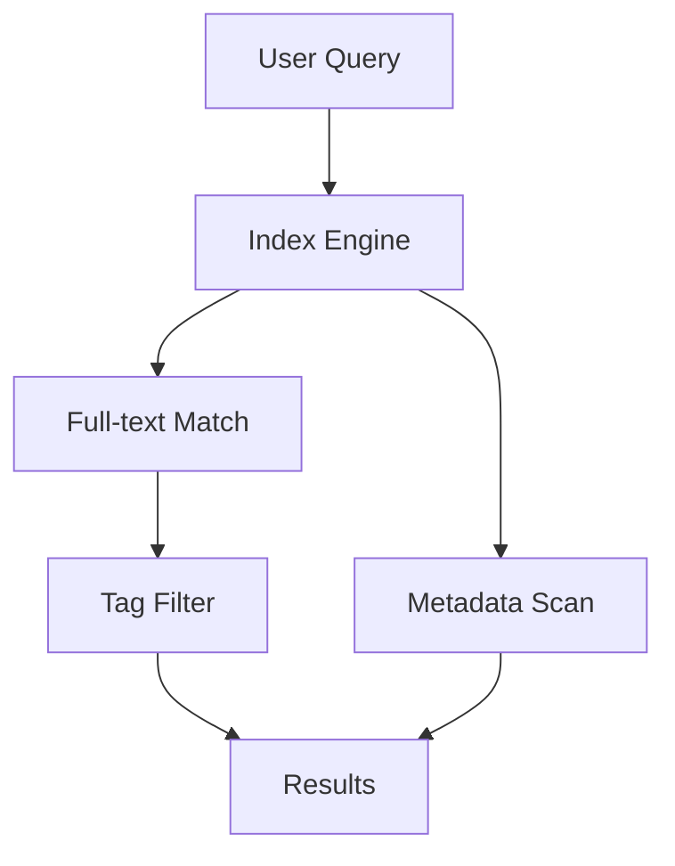

## Overview

Duyên Phan provides powerful tools to organize, collaborate on, search, and share your documentation effectively. You create structured spaces for projects, track changes with version control, find content quickly, and export pages for external use. These features streamline your workflow from initial setup to distribution.

<Columns cols={3}>
  <Card title="Organization" icon="folder" href="#">
    Structure docs with folders and tags.
  </Card>
  <Card title="Collaboration" icon="users" href="#">
    Work with teams using version history.
  </Card>
  <Card title="Search" icon="search" href="#">
    Index and query content instantly.
  </Card>
</Columns>

## Document Organization Tools

You organize documentation using hierarchical folders, tags, and custom metadata. Create nested structures for large projects and apply labels for quick filtering.

<Steps>
  <Step title="Create Folders" icon="folder-plus">
    Navigate to your workspace and select **New Folder**. Name it descriptively, such as `api-reference`.
  </Step>
  <Step title="Add Tags" icon="tag">
    Edit a page and assign tags like `v1.0` or `internal`. Use them in queries later.
  </Step>
  <Step title="Set Metadata" icon="settings">
    Configure page-level YAML frontmatter for SEO or custom fields.

````yaml
---
title: API Endpoint
tags: ["api", "v2"]
status: "draft"
---
````

  </Step>
</Steps>

<Callout kind="tip">
  Use consistent naming conventions like `kebab-case` for folders to improve discoverability.
</Callout>

## Collaboration and Version Control

Team members collaborate seamlessly with real-time edits, comments, and full Git-based version control. You review changes, revert commits, and merge branches directly in the interface.

<Tabs>
  <Tab title="Real-time Editing" icon="edit-3">
    Multiple users edit simultaneously. Changes appear live with user indicators.
  </Tab>
  <Tab title="Version History" icon="git-branch">
    View diffs and restore previous versions.

````javascript
// Example: Fetch version history via API
const history = await fetch('/api/pages/my-doc/versions');
const versions = await history.json();
console.log(versions); // [{ id: "v1.2", date: "2024-10-01", author: "user1" }]
````

  </Tab>
  <Tab title="Merge Requests" icon="git-pull-request">
    Propose changes for approval with inline comments.
  </Tab>
</Tabs>

## Search and Indexing Capabilities

Duyên Phan indexes all content automatically, supporting full-text search, tag filters, and advanced queries. You find pages by keyword, author, or custom metadata in milliseconds.

| Feature | Description | Example Query |
|---------|-------------|---------------|
| Full-text | Matches across titles and body | `authentication flow` |
| Tags | Filters by labels | `tag:v2 AND status:draft` |
| Metadata | Searches custom fields | `author:duyen status:published` |

<Expandable title="Advanced Search Syntax" default-open="false">
  Combine operators: `title:"API Guide" OR tag:feature >date:2024-01-01`.
</Expandable>



## Export and Sharing Options

Share documentation via public links, PDF exports, or API integrations. You generate static sites or embed pages in external tools.

<CodeGroup tabs="Markdown,HTML,PDF">
  ```bash
  # Export single page as Markdown
  duyenvan export my-page.md --format md
  ```
  ```bash
  # Generate HTML bundle
  duyenvan export project --format html --output dist/
  ```
  ```bash
  # PDF with custom styles
  duyenvan export docs --format pdf --theme dark
  ```
</CodeGroup>

<Callout kind="success">
  Public links include analytics to track views and engagement.
</Callout>