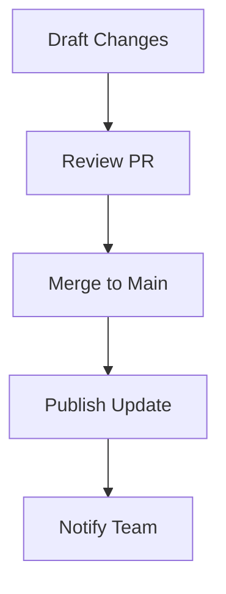

## Overview

Maintain high-quality documentation in your Duyên Phan Documentation space by following these best practices. You organize content effectively, keep it current, and enable smooth team collaboration. Start with clear structure and consistent processes to avoid common issues.

<Callout kind="tip">
  Prioritize readability: Use short sentences, active voice, and visual components like `<Steps>` and `<Tabs>` to guide readers.
</Callout>

## Structuring Content Hierarchically

Build a logical hierarchy to help users navigate quickly. Begin with high-level overviews under H2 headings, then drill down with H3 and H4 subsections. Avoid skipping levels to maintain accessibility.

<Steps>
  <Step title="Plan Your Outline" icon="book-open">
    Map topics using a tree structure:

    ```
    docs/
    ├── guide.mdx
    ├── api/
    │   └── endpoints.mdx
    └── changelog.mdx
    ```
  </Step>
  <Step title="Use Frontmatter" icon="settings">
    Add YAML frontmatter to every page for SEO and navigation:

    ```yaml
    ---
    title: API Endpoints
    description: Core API documentation.
    ---
    ```
  </Step>
  <Step title="Incorporate Components" icon="code">
    Mix `<Columns>`, `<Tabs>`, and code blocks for engaging content.
  </Step>
</Steps>

<Columns cols={2}>
  <Card title="Home & Guides" icon="home" href="/guide">
    Entry points and tutorials.
  </Card>
  <Card title="API Reference" icon="api" href="/api">
    Technical details and examples.
  </Card>
  <Card title="Changelog" icon="git-branch" href="/changelog">
    Release history.
  </Card>
  <Card title="FAQ" icon="help-circle" href="/faq">
    Common questions.
  </Card>
</Columns>

## Versioning and Updates Workflow

Establish a workflow for changelog management. Use semantic versioning and tag updates clearly.

<Tabs>
  <Tab title="Minor Release" icon="plus">
    Add new features without breaking changes.

    <CodeGroup tabs="MDX,Bash">
    ````mdx
    <Update label="2024-10-15" description="v1.2.0" tags={["feature"]}>
    ## New Features
    - Added Tabs component support
    </Update>
    ````
      ```bash
      git add docs/changelog.mdx
      git commit -m "docs: v1.2.0 release"
      git push origin main
      ```
    </CodeGroup>
  </Tab>
  <Tab title="Breaking Change" icon="alert-triangle">
    Document migrations prominently.

    <CodeGroup tabs="MDX">
    ````mdx
    <Update label="2024-09-20" description="v2.0.0" tags={["breaking"]}>
    ## Breaking Changes
    - Removed legacy `<Mermaid>` component
    - Use mermaid code blocks instead
    </Update>
    ````
    </CodeGroup>
  </Tab>
</Tabs>



## Team Collaboration Strategies

Foster collaboration with pull requests and reviews. Assign roles: writers for content, reviewers for consistency.

- Use GitHub issues for feedback.
- Review MDX syntax before merging to prevent parsing errors.
- Schedule bi-weekly doc sprints.

<Callout kind="info">
  Integrate tools like GitHub Discussions for async feedback on drafts.
</Callout>

## Common Pitfalls and Solutions

<ExpandableGroup>
  <Expandable title="Pitfall: Parsing Errors from Unescaped Characters" default-open="true">
    Raw `{` or `<` in prose breaks MDX. **Solution:** Wrap in backticks like `{API_KEY}` or `<Component>`. Always verify with a linter.
  </Expandable>
  <Expandable title="Pitfall: Inconsistent Hierarchy">
    Skipping from H2 to H4 confuses screen readers. **Solution:** Follow H2 → H3 → H4 strictly.
  </Expandable>
  <Expandable title="Pitfall: Outdated Content">
    Docs drift from code. **Solution:** Link changelogs to code releases and automate previews.
  </Expandable>
</ExpandableGroup>