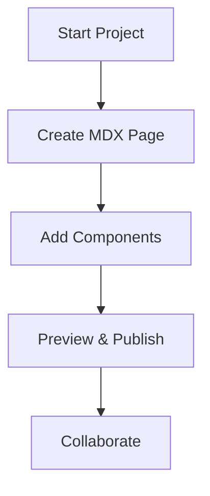

## Overview

You now have access to Duyên Phan Documentation, your centralized platform for organizing project documentation. This space helps you create, manage, and collaborate on docs efficiently. Use it to build guides, API references, and changelogs with modern MDX components.

<Columns cols={3}>
  <Card title="Centralized Hub" icon="database" href="#">
    Store all project docs in one place with version control.
  </Card>
  <Card title="Collaborative Editing" icon="users" href="#">
    Team members edit simultaneously with real-time previews.
  </Card>
  <Card title="Modern Components" icon="components" href="#">
    Leverage rich UI elements like tabs, steps, and cards.
  </Card>
</Columns>

## Core Purpose and Benefits

Duyên Phan Documentation streamlines your workflow. You focus on content while the platform handles rendering, search, and navigation. Key benefits include:

- **Scalability**: Handle docs from small projects to enterprise-scale libraries.
- **Customization**: Apply your brand color `{`#3B82F6`}` across themes.
- **Searchable**: Full-text search finds content instantly.

<Callout kind="tip">
  Customize your site's primary color to `#3B82F6` in the theme config for consistent branding.
</Callout>

## Getting Oriented

Navigate the interface quickly with these steps.

<Steps>
  <Step title="Access Dashboard" icon="layout">
    Log in to view your documentation spaces and recent edits.
  </Step>
  <Step title="Create Page" icon="plus">
    Click the `+ New Page` button and select MDX template.
  </Step>
  <Step title="Preview Changes" icon="eye">
    Use live preview to see components render in real-time.
  </Step>
</Steps>

## Brand Guidelines

Maintain consistency with Duyên Phan Documentation's brand. Primary color is `#3B82F6` for buttons, links, and accents.

<Tabs>
  <Tab title="CSS Variables" icon="code">
    Define brand colors in your stylesheet:

    <CodeGroup tabs="CSS,SCSS">
```css
:root {
  --primary-color: #3B82F6;
  --primary-hover: #2563EB;
}
```
```scss
:root {
  --primary-color: #3B82F6;
  --primary-hover: lighten(#3B82F6, 5%);
}
```
    </CodeGroup>
  </Tab>
  <Tab title="Component Usage" icon="settings">
    Apply the color to components:

    ```jsx
    <Card 
      title="Example" 
      style={{ '--primary-color': '#3B82F6' }}
      href="/docs/example"
    >
      Branded card content.
    </Card>
    ```
  </Tab>
</Tabs>

<Expandable title="Advanced Theming" default-open="false">
  For custom themes, edit `theme.config.js`:

  ```javascript
  export default {
    color: {
      primary: '#3B82F6',
    },
    fonts: {
      body: 'Inter, sans-serif',
    },
  };
  ```

  Restart your dev server after changes.
</Expandable>

## Quick Workflow



This setup ensures you produce professional docs efficiently. Explore features and start building today.